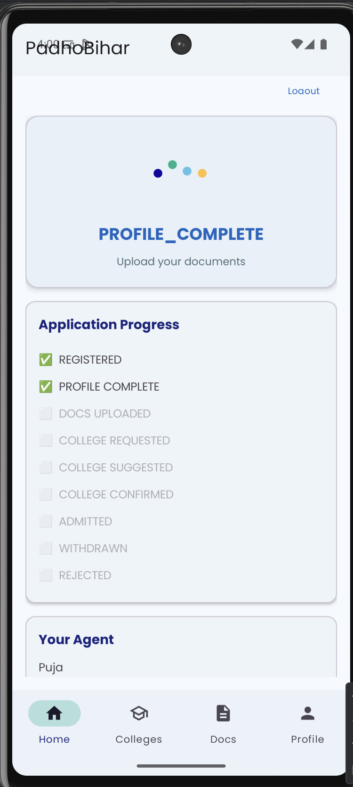
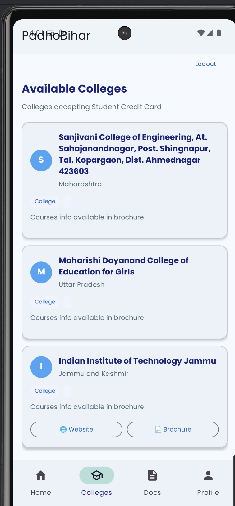
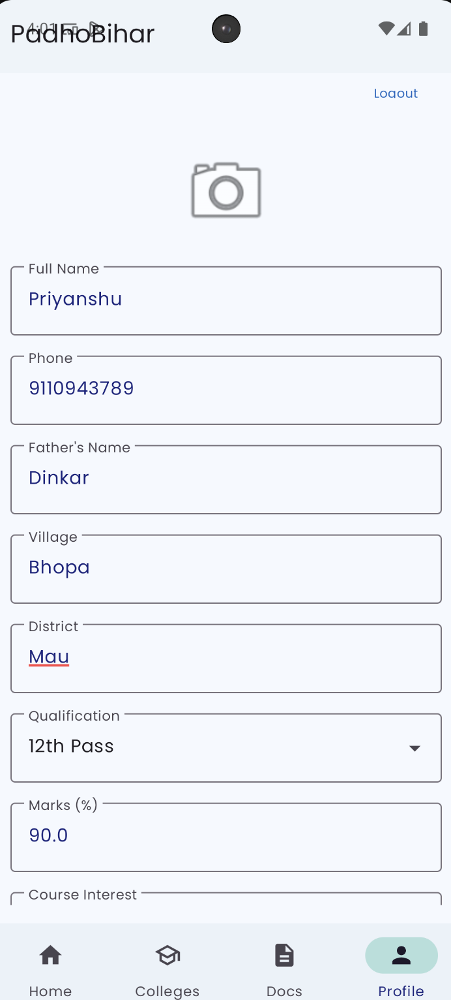
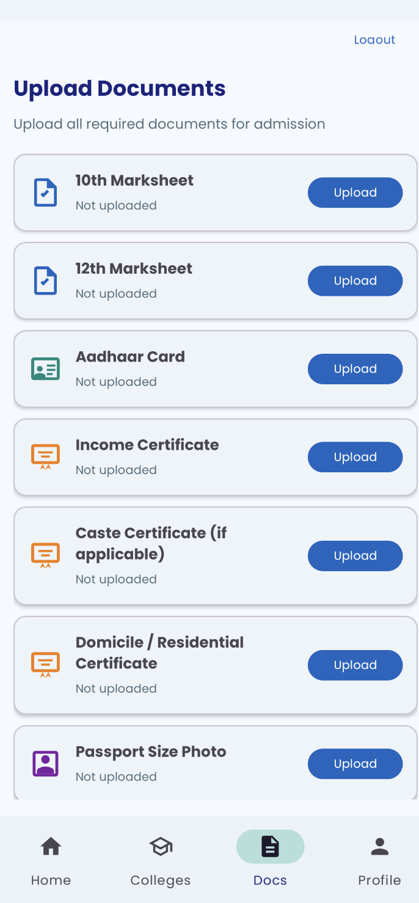
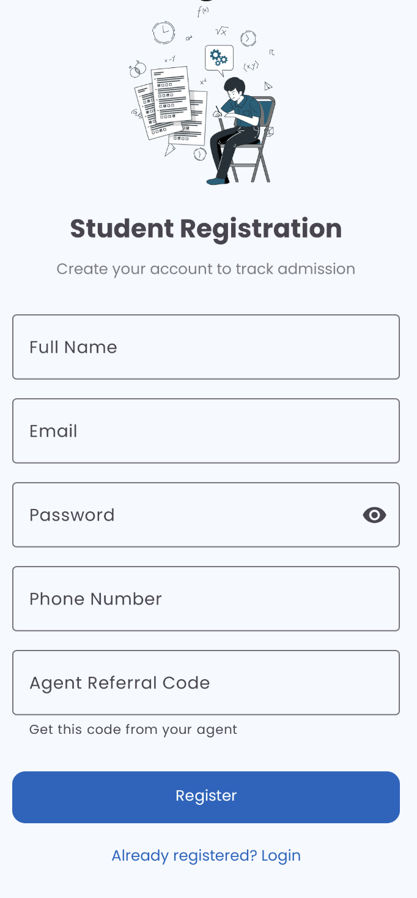
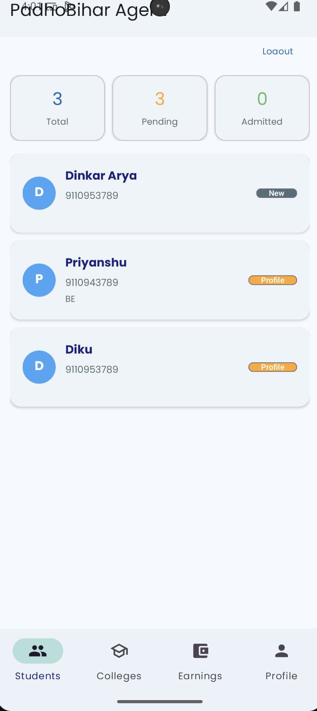
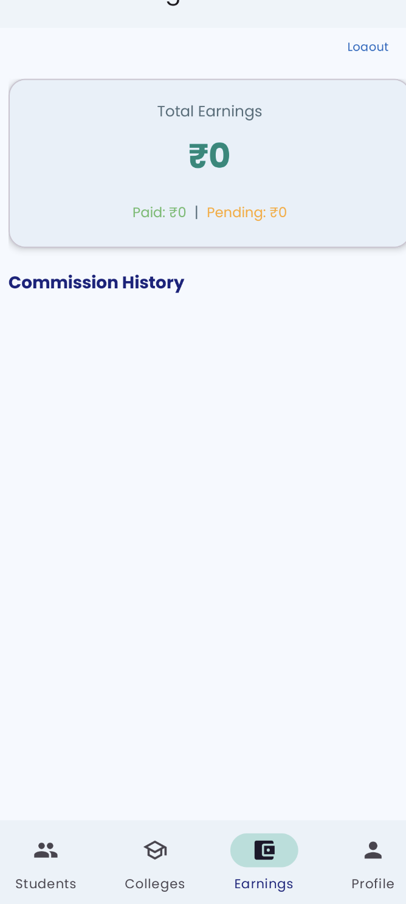
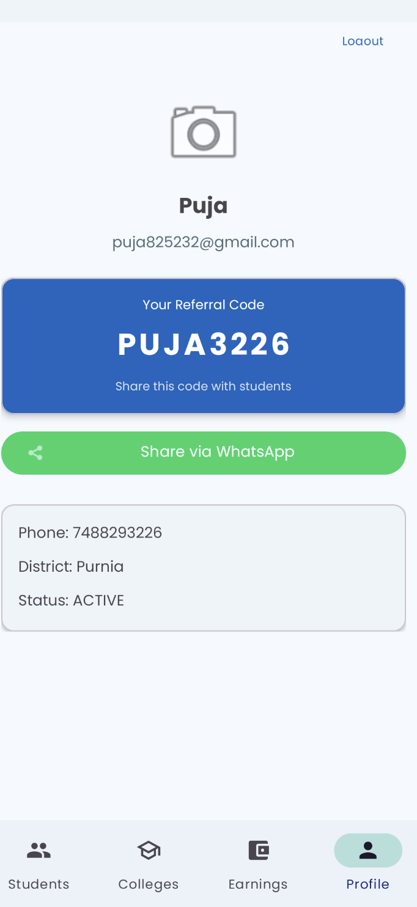

# 🎓 PadhoBihar

> **"शिक्षा से बदलेगा बिहार"** — Aapka Admission Partner

A role-based Android app that digitizes the education admission process in Bihar using the Student Credit Card scheme. Connects Students, Agents, and Admins on a single platform.

---

## 📱 Screenshots

| Splash | Login | Register |
|:------:|:-----:|:--------:|
|  |  |  |

| Student | Agent | Admin |
|:-------:|:-----:|:-----:|
|  |  |  |

| College Search | Documents | Profile |
|:--------------:|:---------:|:-------:|
|  |  | |

---

## 🏗️ Architecture

```
┌─────────────────────────────────────────────────┐
│                    UI Layer                       │
│  Activities / Fragments / Adapters / Layouts      │
├─────────────────────────────────────────────────┤
│                ViewModel Layer                    │
│  StudentViewModel / AgentViewModel / AdminVM      │
│  UiState<T> / LiveData / Timber Logging           │
├─────────────────────────────────────────────────┤
│               Domain Layer                        │
│  Models / Repository Interfaces / Use Cases       │
├─────────────────────────────────────────────────┤
│                Data Layer                         │
│  FirebaseAuthRepo / FirebaseStudentRepo /          │
│  FirebaseCollegeRepo / FirebaseCommissionRepo      │
├─────────────────────────────────────────────────┤
│              Firebase (Backend)                    │
│  Auth / Firestore / (Storage on Blaze plan)       │
└─────────────────────────────────────────────────┘
```

---

## 🎯 Features

### 👨‍🎓 Student
- Register with agent referral code
- Fill profile (name, phone, village, district, marks)
- Upload documents (10th, 12th marksheet, Aadhaar, certificates)
- Browse 70,000+ Indian colleges
- Request admission to preferred college
- Accept/Withdraw from agent's college suggestion
- Chat with agent via WhatsApp
- Track application status (real-time timeline)

### 🧑‍💼 Agent
- Invite-only registration (by Admin)
- Unique referral code to share with students
- View all linked students with status
- Review student profiles & documents
- Approve/Suggest college for students
- Track earnings & commissions
- Share referral code via WhatsApp

### 🔐 Admin
- Email + Password login
- Invite Agents (creates account + sends password setup email)
- Add colleges from 70K+ India database (searchable)
- Upload college brochures (PDF)
- View all students across agents
- Confirm/Reject admissions
- Auto-generate commissions (70% agent, 30% admin)
- Mark payments as completed

---

## 🔄 Application Flow

```
Student Registers (with agent code)
    → REGISTERED
    → Fills Profile → PROFILE_COMPLETE
    → Uploads Docs → DOCS_UPLOADED
    → Selects College → COLLEGE_REQUESTED
    → Agent Approves/Suggests → COLLEGE_CONFIRMED/SUGGESTED
    → Student Accepts → COLLEGE_CONFIRMED
    → Admin Confirms → ADMITTED (commission auto-created)
```

---

## 🛠️ Tech Stack

| Layer | Technology |
|-------|-----------|
| Language | Kotlin |
| Architecture | MVVM + Clean Architecture |
| UI | XML + ViewBinding + Material 3 |
| DI | Hilt |
| Async | Coroutines + Flow |
| Backend | Firebase (Auth + Firestore) |
| Animations | Lottie |
| Logging | Timber |
| Security | EncryptedSharedPreferences |
| Font | Poppins (Google Fonts) |
| Min SDK | 24 (Android 7.0) |

---

## 📂 Project Structure

```
com.dp.padhobihar/
├── PadhoBiharApp.kt                 # Hilt Application + init
├── di/                              # Dependency Injection
│   ├── FirebaseModule.kt
│   └── RepositoryModule.kt
├── domain/
│   ├── model/                       # Data classes + Enums
│   │   ├── User.kt
│   │   ├── Student.kt
│   │   ├── College.kt
│   │   ├── Commission.kt
│   │   ├── Role.kt
│   │   └── ApplicationStatus.kt
│   └── repository/                  # Interfaces (contracts)
│       ├── AuthRepository.kt
│       ├── UserRepository.kt
│       ├── StudentRepository.kt
│       ├── CollegeRepository.kt
│       └── CommissionRepository.kt
├── data/
│   ├── repository/                  # Firebase implementations
│   │   ├── FirebaseAuthRepository.kt
│   │   ├── FirebaseUserRepository.kt
│   │   ├── FirebaseStudentRepository.kt
│   │   ├── FirebaseCollegeRepository.kt
│   │   └── FirebaseCommissionRepository.kt
│   └── local/
│       └── CollegeDataSource.kt     # 70K colleges (local search)
├── ui/
│   ├── splash/SplashActivity.kt
│   ├── auth/                        # Login + Registration
│   ├── student/                     # Student screens (4 fragments)
│   ├── agent/                       # Agent screens (4 fragments)
│   ├── admin/                       # Admin dashboard
│   └── common/                      # Shared adapters
└── utils/
    ├── Navigator.kt                 # Clean navigation
    ├── Validator.kt                 # Input sanitization
    ├── SafeCall.kt                  # Exception wrapper
    ├── RateLimiter.kt               # Brute-force protection
    ├── SecurePrefs.kt               # Encrypted storage
    ├── WhatsAppHelper.kt            # Chat deeplink
    ├── NetworkUtils.kt              # Connectivity check
    └── UiState.kt                   # Loading/Success/Error states
```

---

## 🚀 Setup & Run

### Prerequisites
- Android Studio Hedgehog+
- JDK 17
- Firebase project with Auth + Firestore enabled

### Steps

1. **Clone**
   ```bash
   git clone https://github.com/aryadk/PadhoBihar.git
   cd PadhoBihar
   ```

2. **Firebase Setup**
   - Create project at [Firebase Console](https://console.firebase.google.com)
   - Enable Email/Password Authentication
   - Enable Cloud Firestore
   - Download `google-services.json` → place in `app/`

3. **Firestore Rules**
   - Copy rules from `docs/firestore_rules.txt`
   - Paste in Firebase Console → Firestore → Rules → Publish

4. **College Data**
   - The app bundles 70K+ colleges in `assets/colleges_india.txt`
   - Or host remotely and update URL in `CollegeDataSource.kt`

5. **Run**
   ```bash
   ./gradlew assembleDebug
   ```
   Install APK on device/emulator.

6. **Create Admin**
   - Firebase Console → Auth → Add user (email/password)
   - Firestore → `users` → Add doc with that UID:
     ```json
     { "name": "Admin", "role": "ADMIN", "status": "ACTIVE" }
     ```

---

## 🧪 Testing

```bash
# Unit tests (37 tests)
./gradlew test

# Integration tests (requires Firebase emulator)
firebase emulators:start
./gradlew connectedAndroidTest
```

---

## 📋 Firestore Collections

| Collection | Purpose |
|-----------|---------|
| `users` | All users (admin, agent, student) with role |
| `students` | Student application records (linked to agent) |
| `student_profiles` | Detailed profile data |
| `student_documents` | Uploaded docs (base64) |
| `colleges` | Active colleges on platform |
| `commissions` | Payment records |

---

## 🎨 Design

- **Light Mode**: White backgrounds + Blue (#1565C0) accents
- **Dark Mode**: Dark surfaces + Light blue (#90CAF9) accents
- **Font**: Poppins (Regular, Medium, SemiBold, Bold)
- **Icons**: Custom Material Design vectors
- **Animations**: Lottie (education-themed)

---

## 📄 License

This project is proprietary. Not open for redistribution.

---

## 👨‍💻 Author

Built by **Arya DK** — Bihar, India

---

*PadhoBihar — Making education accessible, one admission at a time.*
